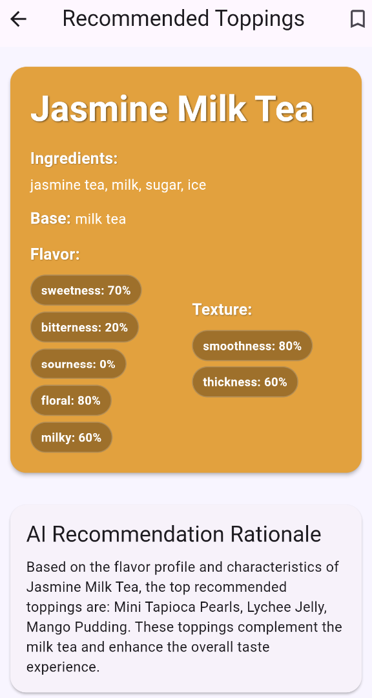
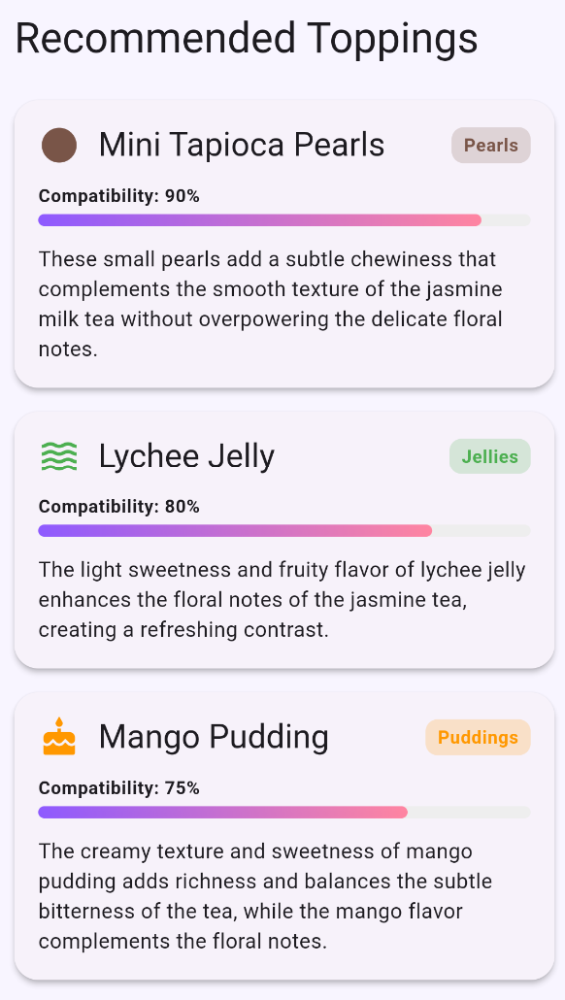

# Smart Boba

A Flutter application that suggests boba drink toppings using AI. The app analyzes the name of a bubble tea drink to identify its ingredients, texture, and flavor profile, then recommends the best toppings to complement it.

## Features

- **Drink Analysis**: Uses AI to analyze boba drink names and extract key properties
- **Topping Recommendations**: Suggests the best toppings for your drink with compatibility scores
- **Voice Input**: Speak your drink name instead of typing
- **Save Recommendations**: Save your favorite recommendations for future reference
- **Clean Architecture**: Follows clean architecture principles for maintainable, testable code

## Technology Stack

- **Flutter**: UI framework
- **BLoC/Provider**: State management
- **Clean Architecture**: Application structure
- **OpenAI API**: AI model integration for drink analysis
- **Speech-to-Text**: Voice input functionality

## AI Model Options

The app supports multiple AI service providers:

1. **Mock Data (Default)**: Uses pre-programmed responses based on drink name patterns. No API key required.
2. **Google Generative AI (Gemini)**: Uses Google's Gemini model for AI analysis.
3. **OpenAI**: Uses OpenAI's GPT models for AI analysis.

## Setup Instructions

### Mock Data Mode (Default)

The app is configured to use mock data by default, which doesn't require any API keys. This is great for testing and development.

### Using Google Generative AI (Gemini)

1. Get an API key from [Google AI Studio](https://makersuite.google.com/app/apikey)
2. Create a `.env` file in the project root with:
   ```
   GOOGLE_AI_API_KEY=your_gemini_api_key_here
   ```
3. Open `lib/core/di/injection_container.dart` and set `useMockData = false`

### Using OpenAI

1. Get an API key from [OpenAI Platform](https://platform.openai.com/)
2. Create a `.env` file in the project root with:
   ```
   OPENAI_API_KEY=your_openai_api_key_here
   ```
3. Open `lib/core/di/injection_container.dart` and set `useMockData = false`
4. Modify the dependency injection in `injection_container.dart` to use OpenAIService instead of GoogleGenerativeAIService

## Mock Data Features

When using mock data mode, the app intelligently recognizes components in drink names like:
- "taro"
- "jasmine"
- "matcha" 
- "brown sugar"

It then provides appropriate flavor profiles and topping recommendations based on these components.

## Getting Started

### Prerequisites

- Flutter SDK (3.4.1 or higher)
- Dart (3.4.1 or higher)
- An API key from OpenAI

### Installation

1. Clone the repository
   ```
   git clone https://github.com/yourusername/smart_boba.git
   ```

2. Navigate to the project directory
   ```
   cd smart_boba
   ```

3. Install dependencies
   ```
   flutter pub get
   ```

4. Create a `.env` file in the root directory with your API key
   ```
   # AI API Keys
   OPENAI_API_KEY=your_openai_api_key_here
   ```

5. Run the app
   ```
   flutter run
   ```

## Project Structure

The project follows clean architecture principles with the following layers:

- **Presentation**: UI components, screens, and BLoC state management
- **Domain**: Business logic, entities, and use cases
- **Data**: Data sources, models, and repository implementations

```
lib/
├── core/
│   ├── constants/
│   ├── di/
│   ├── error/
│   ├── theme/
│   └── widgets/
└── features/
    └── boba_recommendation/
        ├── data/
        │   ├── datasources/
        │   ├── models/
        │   └── repositories/
        ├── domain/
        │   ├── entities/
        │   ├── repositories/
        │   └── usecases/
        └── presentation/
            ├── bloc/
            ├── screens/
            └── widgets/
```

## How It Works

1. Enter the name of your boba drink (e.g., "Jasmine Milk Tea", "Matcha Latte", etc.)
2. The app uses OpenAI to analyze the drink's composition, flavor profile, and texture
3. Based on this analysis, the app recommends the best toppings with compatibility scores
4. Each recommendation includes details about why the topping pairs well with your drink
5. Save recommendations you like for future reference

## API Usage Notes

The app uses OpenAI's GPT-3.5-Turbo model by default. This offers a good balance between accuracy and cost. If you prefer to use the more powerful GPT-4 model, you can modify the `openAIModel` constant in the `app_constants.dart` file.

## License

This project is licensed under the MIT License - see the LICENSE file for details.

## Acknowledgements

- OpenAI for providing powerful AI models
- Flutter and Dart teams for the wonderful framework
- Boba tea shops everywhere for the inspiration

## Screenshots




